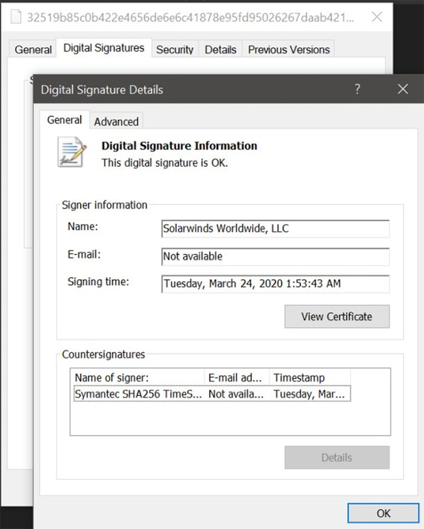
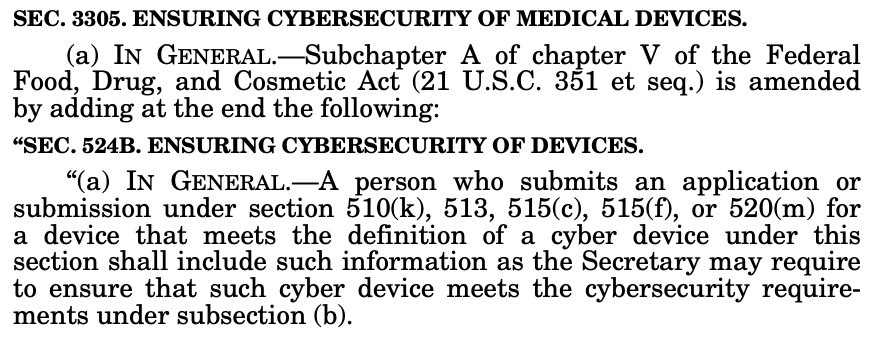
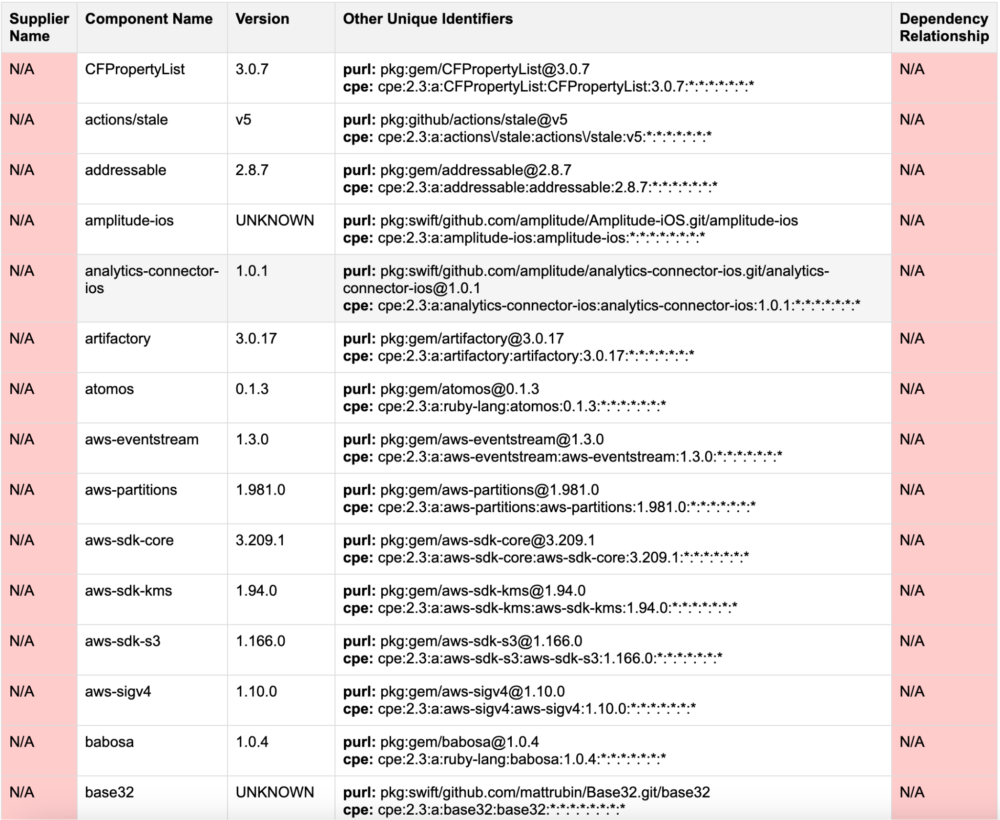

# SPQR Open House: The BOMoculars Project

Christopher Pellegrini, Dr. Yan Long, Professor Kevin Fu

---

# The Need for SBOMs

Modern medical devices rely on complex software supply chains with numerous third-party components

- Critical medical devices may contain hundreds of software components
- Many manufacturers lack visibility into their own software
- Software vulnerabilities can impact patient safety

---

# High Profile Attacks

The 2017 WannaCry ransomware attack and the 2020 SolarWinds breach have accelerated the push towards greater transparency

- Medical devices were significantly impacted by WannaCry, with approximately 34% of UK hospital trusts affected

---

# Regulatory Landscape

- President Biden issued EO 14028 on Improving the Nation's Cybersecurity
- NTIA responded with Minimum Elements for a Software Bill of Materials in July 2021
- FDA 524(B) requirements for cyber device submissions 
- International Medical Device Regulators Forum (IMDRF) guidance

---

# What is an SBOM?

"An SBOM is like a nutritional label or ingredients list for software"

<table>
  <tr>
    <th>Data Field</th>
    <th>Description</th>
  </tr>
  <tr>
    <td>Supplier</td>
    <td>Creates/identifies components</td>
  </tr>
  <tr>
    <td>Component</td>
    <td>Software unit by supplier</td>
  </tr>
  <tr>
    <td>Version</td>
    <td>Tracks changes between releases</td>
  </tr>
  <tr>
    <td>Identifiers</td>
    <td>Keys for component lookup</td>
  </tr>
  <tr>
    <td>Dependencies</td>
    <td>Component relationships</td>
  </tr>
  <tr>
    <td>Author</td>
    <td>Creator of SBOM data</td>
  </tr>
  <tr>
    <td>Timestamp</td>
    <td>SBOM creation time</td>
  </tr>
</table>

---

# The BOMoculars Project

- Evaluating and improving SBOM generation for iOS medical applications
- Project phases: Survey → Benchmark → Tool Development

---

# Current Status: Survey Phase

- Systematically surveying device manufacturers and healthcare delivery organizations
- Identifying regional differences between domestic and Korean SBOM practices
- Cataloging existing tools and methodologies

---

# Technical Challenges

- Missing supplier information
- Incomplete dependency relationships
- Unknown versions in Swift packages
- Lack of specialized tools for iOS/Swift ecosystem

---

# Next Phase: Tool Benchmarking

- Testing existing SBOM generators against SaMD iOS applications
- Metrics: completeness, accuracy, and format compliance
- Focus on open-source medical applications like Loop insulin dosing app

---

# Building BOMoculars

- Developing a specialized SBOM generation and validation tool for Swift
- Addressing unique challenges of iOS package ecosystem
- Aiming to exceed accuracy rates of existing tools

---

# Summer Research Opportunities

**Roles Needed:**
- iOS/Swift Developers
- Security Researchers
- Data Visualization Specialists

**Skills You'll Develop:**
- Security analysis
- Medical device regulatory knowledge
- SBOM generation/analysis

---

# Why This Matters

- Improved SBOMs = Better vulnerability management = Enhanced patient safety
- Our tools will help manufacturers meet regulatory requirements and improve security
- Contributing to the foundation of medical device security

---

# The "Turtles All The Way Down" Problem

Dependency chains can be endless - where do we stop?

- Standard libraries are tied to runtime versions
- Third-party libraries have their own dependencies
- Finding the right depth is crucial for meaningful SBOMs

---

# Contact Information

pellegrini.ch@northeastern.edu

Let's chat about summer opportunities!